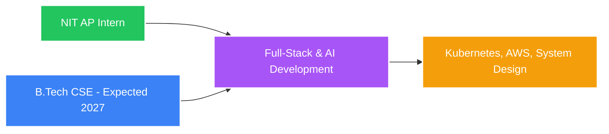
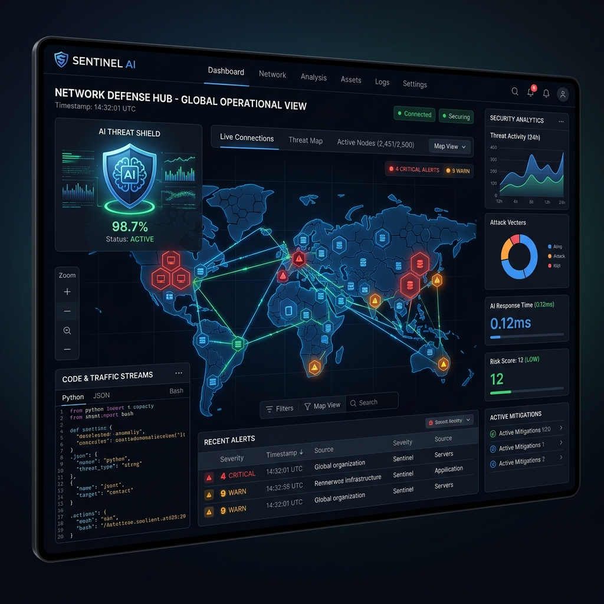
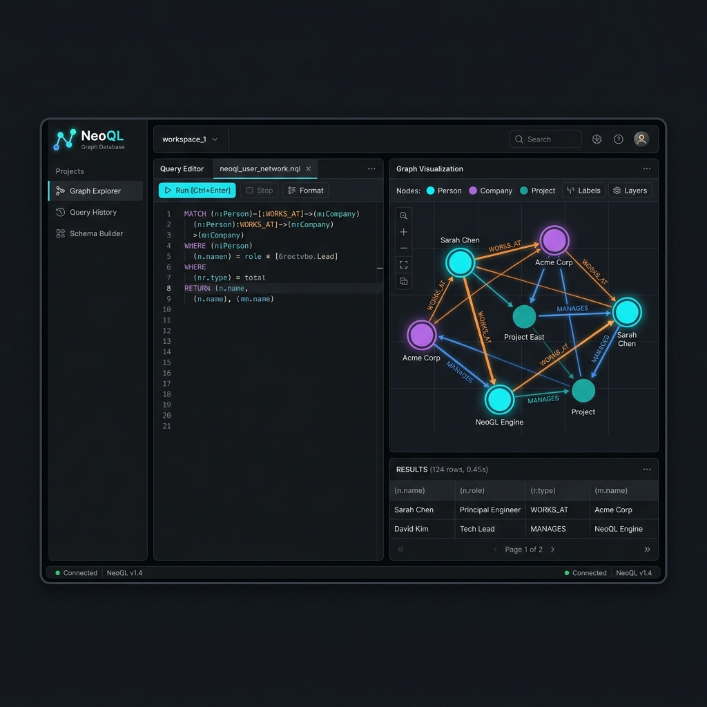
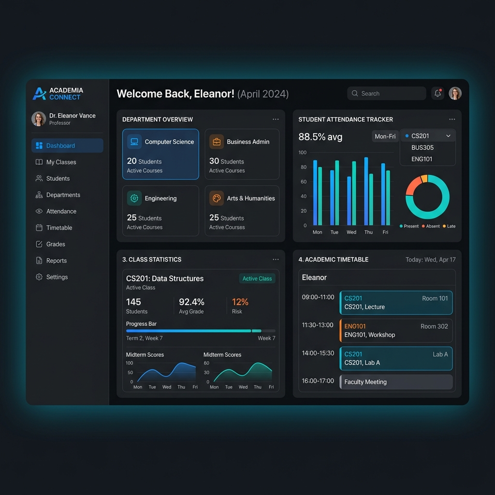
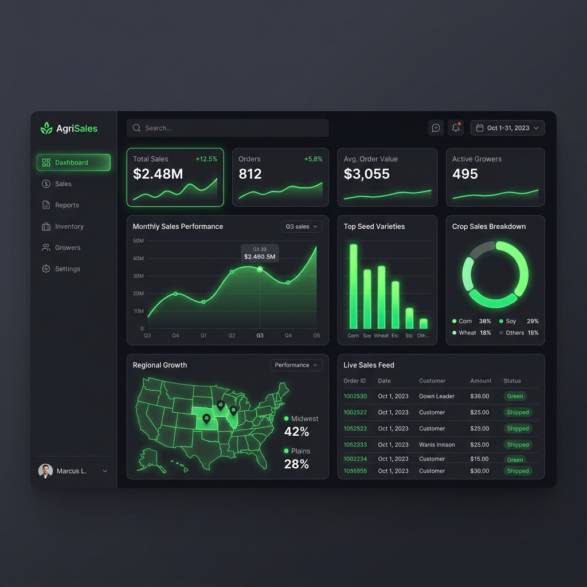
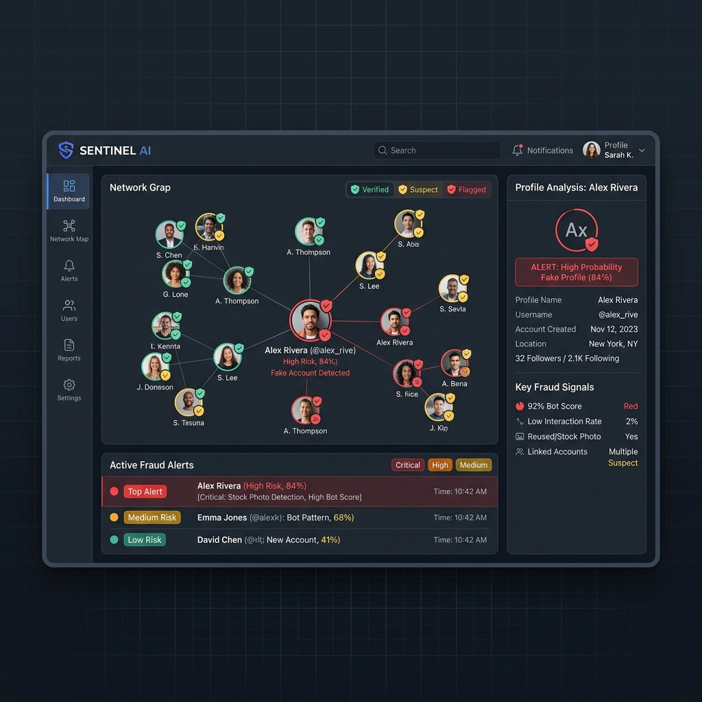

  <table border="0" style="border: none; border-collapse: collapse;">
    <tr style="border: none;">
      <td width="65%" style="border: none; vertical-align: middle;">
        <h1>Hi 👋, I'm Sandeep Kumar Tiparthi</h1>
        <h3>Software Developer • Computer Science Engineer • Full-Stack & AI Builder</h3>
        
Designing efficient, user-centric systems that solve real-world problems through innovative technology.

        
      </td>
      <td width="35%" align="center" style="border: none; vertical-align: middle;">
        
      </td>
    </tr>
  </table>

---

## ⚡ Quick Overview

* **🎓 Academic Milestones:**
  * **B.Tech in Computer Science & Engineering** | Sasi Institute of Technology, Tadepalligudem (Expected Jan 2027 · **CGPA: 8.52 / 10**)
  * **Diploma in Computer Science Engineering** | Smt. B. Seetha Polytechnic, Bhimavaram (Jan 2024 · **Score: 90.22%**)
* **💼 Professional Experience:**
  * **Software Development Intern** | NIT Andhra Pradesh (Remote · May 2026 – July 2026)
    * Assisted in project development, documentation, and collaborative data organization.
* **🌱 Currently Leveling Up:** System Design, Docker, Kubernetes, AWS, and AI Agents.
* **📜 Certifications:** Cisco Cybersecurity & Computer Skills • NPTEL IoT (IIT Kharagpur, 77%) • MyAccess Python Programming.

---

## 🌐 Connect With Me

  
  
  

---

# 💻 Tech Stack

### Languages

<b>🛠️ Click to expand full ecosystem</b>

| Category | Technologies |
|---|---|
| **Frontend & UI** | React • Next.js • TailwindCSS • HTML5 • CSS3 |
| **Backend & APIs** | Node.js • Express • Django • Flask • FastAPI |
| **Databases & ORMs** | MySQL • SQLite • MongoDB • Supabase |
| **AI / Machine Learning** | OpenCV • NumPy • Pandas • Scikit-Learn • Matplotlib |
| **Dev Tools & CI/CD** | Git • GitHub • Docker • GitHub Actions |
| **Deployment** | Vercel • Railway • Render • Netlify |

---

# 🚀 Featured Projects

| Project | Details | Codebase |
|---------|---------|:---:|
|  | **🛡 AegisSwarm AI Defense Hub** AI-powered multi-agent cybersecurity swarm pipeline for automated self-healing threat response with real-time logs and dashboard.  _React • Vite • WebSockets • Tailwind_ | [Explore](https://github.com/sandeepkumartiparthi) |
|  | **🔐 NeoQL Query Engine** Custom graph query interface and AST parser combining SQL select structures with Neo4j-style node and relationship patterns.  _TypeScript • Node.js • AST Parser • GraphDB_ | [Explore](https://github.com/sandeepkumartiparthi) |
|  | **🎓 Django College ERP System** Multi-role (Admin, HOD, Teacher, Student) Enterprise Resource Planning portal featuring session attendance trackers and department metrics.  _Django • Python • SQLite • Tailwind_ | [Explore](https://github.com/sandeepkumartiparthi) |
|  | **📊 Agricultural Sales Analytics** Full-stack agricultural analytics platform for market intelligence, forecasting, and responsive dashboard.  _Node.js • React • Express • MongoDB_ | [Explore](https://github.com/sandeepkumartiparthi) |
|  | **🔎 Fake Profile Detection** Machine learning system employing classification models to analyze social network datasets and flag suspicious accounts.  _Python • Scikit-Learn • NumPy • Pandas_ | [Explore](https://github.com/sandeepkumartiparthi) |
|  | **📄 Transfer Certificate Generator** Secure web administration portal to digitize and automate school Transfer Certificate creation and records retrieval.  _PHP • MySQL • HTML • CSS • JS_ | [Explore](https://github.com/sandeepkumartiparthi) |

---

# 📊 GitHub Analytics

  

  

  

---

## 📈 Contribution Graph

---

## 👀 Profile Views

---

> *"Designing efficient, user-centric systems that solve real-world problems through innovative technology and clean architecture."*
